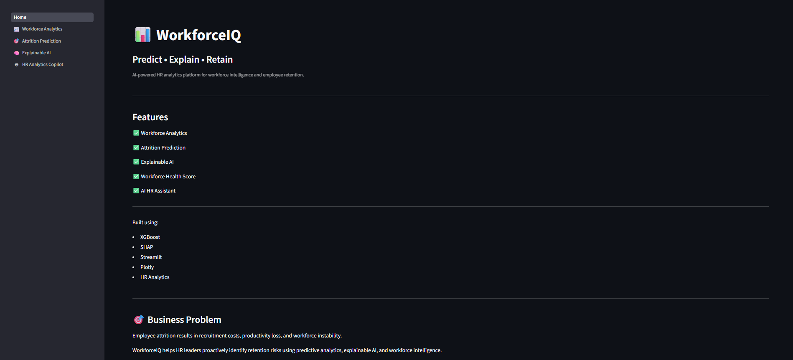
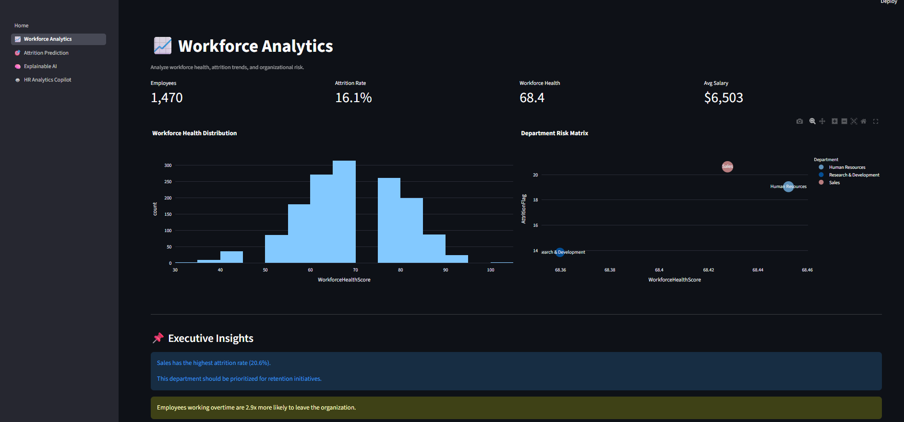
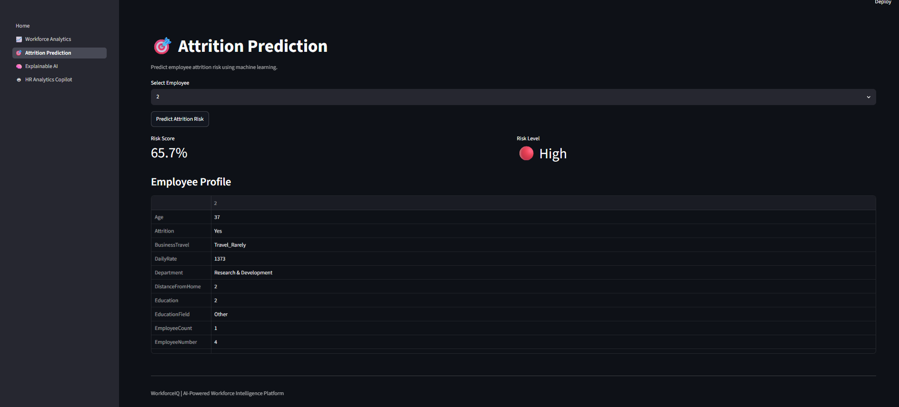
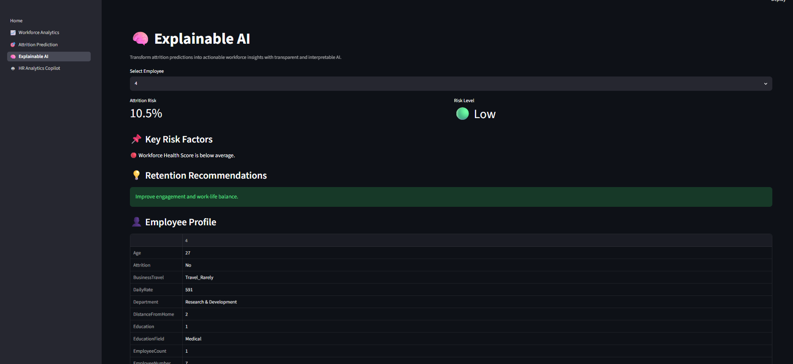
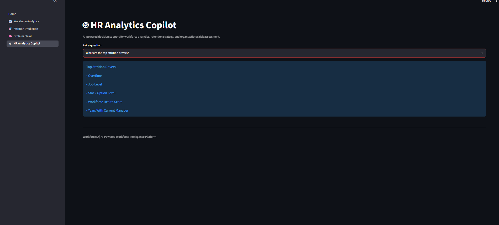

<p align="center">
  <h1 align="center">🚀 WorkforceIQ</h1>
  <p align="center">
    Predict • Explain • Retain
  </p>
</p>


<p align="center">
  AI-Powered Workforce Intelligence Platform
</p>


WorkforceIQ is an end-to-end HR Analytics platform designed to help organizations proactively identify employee attrition risks, monitor workforce health, and make data-driven retention decisions through Machine Learning and Explainable AI.

---

### Home Page



### Workforce Analytics Dashboard



### Attrition Prediction



### Explainable AI



### HR Analytics Copilot



---

## 🎯 Business Problem

Employee attrition leads to:

* Increased recruitment and onboarding costs
* Loss of organizational knowledge
* Reduced productivity
* Workforce instability

Traditional HR reporting is often reactive. Organizations need proactive workforce intelligence to identify risks before employees leave.

---

## 💡 Solution

WorkforceIQ transforms workforce data into actionable insights through:

* Workforce Analytics Dashboard
* Employee Attrition Prediction
* Explainable AI
* Workforce Health Scoring
* Workforce Risk Segmentation
* HR Analytics Copilot

The platform enables HR leaders to analyze workforce trends, predict employee attrition, understand risk drivers, and make informed retention decisions.

---

## ✨ Key Features

### 📈 Workforce Analytics

* Executive workforce dashboard
* Attrition trend analysis
* Department risk analysis
* Workforce health monitoring
* Workforce risk segmentation

### 🎯 Attrition Prediction

* Employee attrition risk prediction
* XGBoost-based machine learning model
* Risk scoring and classification

### 🧠 Explainable AI

* Transparent prediction explanations
* Workforce risk factor identification
* Actionable retention recommendations

### 🤖 HR Analytics Copilot

* Interactive workforce intelligence assistant
* HR-focused analytical insights
* Decision-support recommendations

---

## 🏗️ System Architecture

```text
WorkforceIQ

├── Workforce Analytics
├── Attrition Prediction
├── Explainable AI
├── HR Analytics Copilot
│
├── XGBoost
├── SHAP
├── Streamlit
├── Plotly
└── Python
```

---

## 🔬 Machine Learning Pipeline

### Data Preparation

* Data Cleaning
* Feature Engineering
* Workforce Health Score Generation

### Model Development

* XGBoost Classifier
* Class Imbalance Handling
* Probability-Based Risk Scoring

### Model Evaluation

| Metric    | Score |
| --------- | ----- |
| Accuracy  | 81.3% |
| Precision | 41.7% |
| Recall    | 42.6% |
| F1 Score  | 42.1% |
| ROC-AUC   | 77.6% |

---

## 🧠 Explainable AI

WorkforceIQ combines predictive analytics with interpretable AI.

Key attrition drivers identified through model explainability include:

* Overtime
* Job Level
* Stock Option Level
* Workforce Health Score
* Years With Current Manager
* Age
* Business Travel

The platform translates model outputs into actionable HR recommendations rather than presenting predictions alone.

---

## ❤️ Workforce Health Score

One of the platform's key innovations is the Workforce Health Score (WHS).

The score combines:

* Job Satisfaction
* Work-Life Balance
* Environment Satisfaction
* Job Involvement

to create a single workforce wellness indicator used for workforce segmentation and attrition analysis.

---


---

## 🛠️ Technology Stack

### Frontend

* Streamlit
* Plotly

### Backend

* Python

### Machine Learning

* XGBoost
* Scikit-Learn

### Explainability

* SHAP

### Data Processing

* Pandas
* NumPy

### Deployment

* Streamlit Cloud

---

## 📂 Project Structure

```text
WorkforceIQ/

├── Home.py
│
├── pages/
│   ├── Workforce_Analytics.py
│   ├── Attrition_Prediction.py
│   ├── Explainable_AI.py
│   └── HR_Analytics_Copilot.py
│
├── data/
├── models/
├── notebooks/
├── utils/
│
└── requirements.txt
```

---

## ⚙️ Installation

```bash
git clone https://github.com/Sanjula2003/WorkforceIQ.git

cd WorkforceIQ

pip install -r requirements.txt

streamlit run Home.py
```

---

## 🚀 Future Enhancements

* Real-time HR Analytics
* Advanced Workforce Forecasting
* Employee Churn Early Warning System
* LLM-Powered HR Copilot
* MLOps Pipeline Integration
* Cloud-Native Deployment

---

## 👨‍💻 Author

**Sanjula Bandara**

GitHub:
https://github.com/Sanjula2003

---

### WorkforceIQ

**Predict • Explain • Retain**
